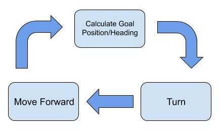
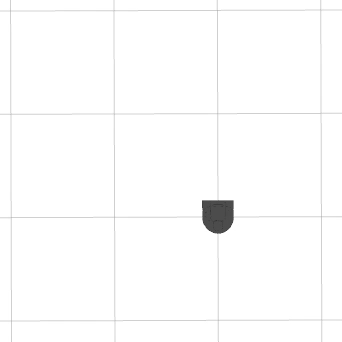
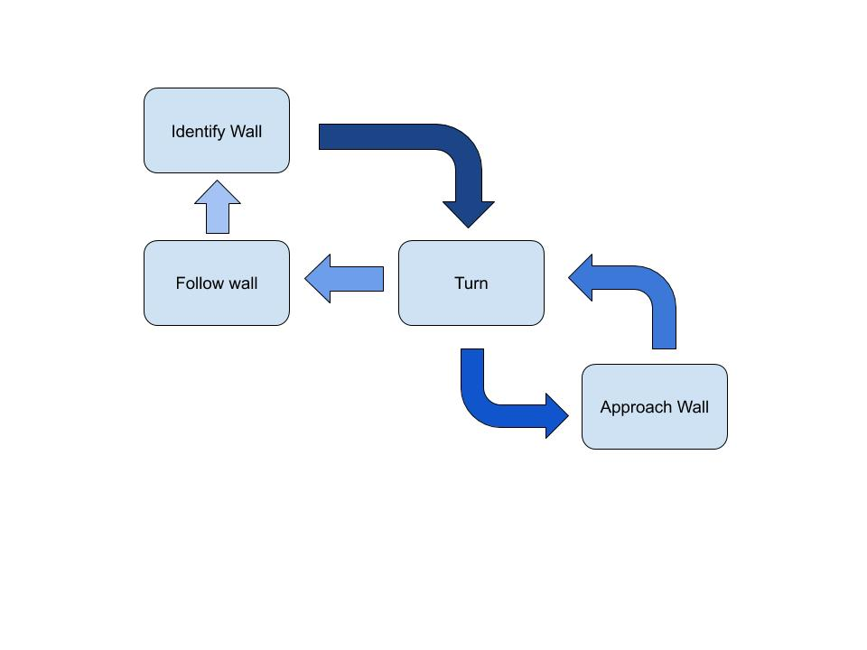
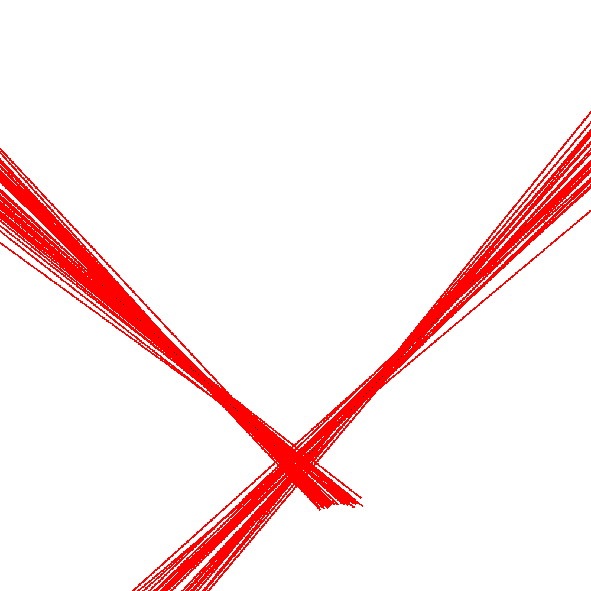
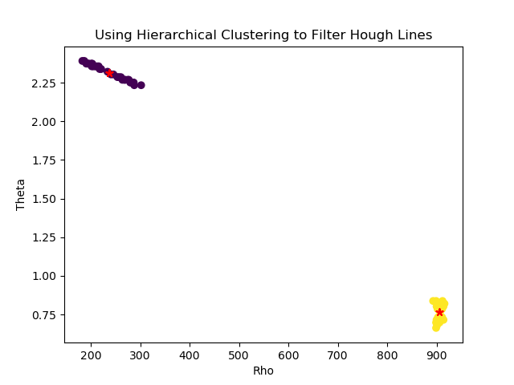
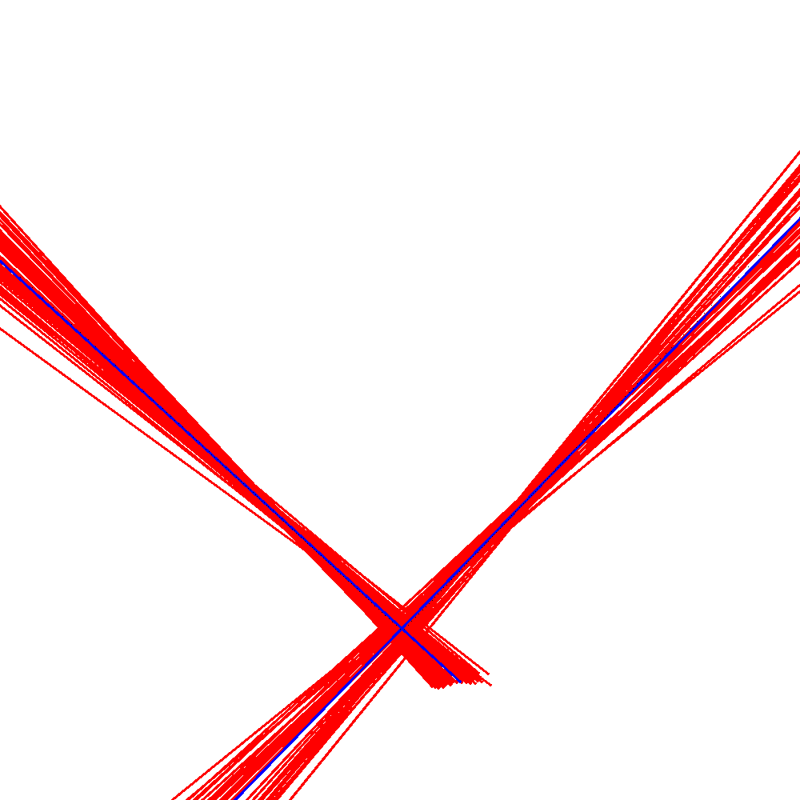

# Comp Robo Warmup Project
This is the base repo for the Olin Computational Robotics warmup project.

<h2>Robot Teleop</h2>

In order to control the robot's movement I wrote a simple teleoperation script that mapped keystrokes to linear and angular velocities. These commanded velocities are published to the <code>cmd_vel</code> ROS topic.
Key | Command
------------ | -------------
W | Forward
S | Reverse
A |Turn Left
D | Turn Right
Q | Stop

<h2>Driving in a Square</h2>

In order to drive in a square, I explored the robot's odometry data. I used a finite state controller and proportional control in order to calculate and move to the next goal position. 

  

<h3>Calculating Goal Point and Position</h3>
This state is called when the robot has reached a corner of the square. Based on what side of the square the robot has moved along, and the current position of the robot using the odometry data, a goal point is calculated. This is either the robot's X position ± 1 or the robot's Y position ± 1. Once the next waypoint is calculated, the heading from the current position to the goal position is calculated using the formula  where a and b are the current and goal positions. Factors of π/2 were added/subtracted as needed to account for the robot's coordinate system.
<h3>Turning</h3>
Once the goal position and angle have been calculated we enter the turning state. In order to proceed to the next waypoint the robot must turn so that its current heading is equal to that of the goal heading. I implemented a simple proportional controller in order to calculate the angular velocity command to be sent to the robot. The error is calculated as the difference between the goal heading and current heading. While the error is above a threshold value, I used 0.1 radians, the robot remains in the turning state and continues turning at an angular velocity equal to that of the error. Once the error is below the threshold, the robot enters the "Moving Forward" state.
<h3>Moving Forward</h3>
Once the robot is in the moving forward state it is facing the goal point, and just needs to move forward in order to reach it. To do this I again used a proportional controller, where the error is the distance between the robot and the goal point. As the robot approaches the waypoint it's velocity decreases proportionally. For both the moving forward and turning controllers, I found a gain value of 1 worked just fine.

<h3>Results, Reflections, and Next Steps</h3>

  
  
I am very pleased with my results. The square was fairly concise, and even after letting the script run for a few minutes the robot remained in relatively the same position. There was a little bit of drift over time but this is to be expected. This could be slightly mitigated by decreasing the threshold values for both proportional controllers. 
Identical behaviour could have been replicated much more concisely with using purely time based controls; however, I think I learned a lot more about the robot's coordinate system and odometry data, finite state controllers, and proportional control through my implementation.
<h2>Wall Following</h2>
To generate wall following behaviour I made use of the Hough Transform and again used a finite state controller. The goal of the behaviour was to be able to identify a wall from any orientation, approach it, and drive parallel to it at a distance of 1m.

  

<h3>Identifying the Wall</h3>
Identifying the wall is probably the most complex aspect of this behaviour. In order to do this I made use of the Hough Transform. The Hough Transform is an algorithm commonly used in computer vision to identify lines within a binary image, often used in tandem with edge detection operators such as the Canny edge detector. The way the Hough transform works is by essentially spinning a line around each point, π radians. At each orientation on each point, this line has a unique angle and offset value, theta and rho. Based on the number of other points this line passes through it is given a value, and lines that pass through more than some threshold number of points are identified as lines. Since the lidar data is relatively sparse I used a threshold value of 4 points to characterize a line/wall. 
I began by subscribing to the lidar topic and because I used OpenCV's version of the Hough Transform I interpolated the data into a 1000x1000 binary image.

  
  
  From there, I used the <code>cv2.HoughLines()</code> function on the inverted binary image. Below visualizes all possible lines consisting of 4 or more points.
 

  
  
 That's a lot of lines despite the fact there are only two walls within view of the robot's lidar. In order to get rid of excess noise I filtered the lines using a technique known as hierarchical clustering. As you can see, even though there are many lines detected, there are two main groups or clusters that reflect the two walls. When viewing these lines in the Hough space this is even more clear. By using hierarchical clustering I was able to group the lines together based on their euclidean distance apart in a normalized Hough space. In order to normalize the Hough space, I interpolated the theta values to have a range of 1000, rather than pi. This helps to differentiate between two walls with similar rho values but different theta values. Once the clusters were formed I took the average rho and theta values for each cluster and used those to represent the wall. 
  

  
   
  The average rho and theta values, given by the red start in the scatter plot, are represented in the image below. As you can see they correlate pretty well with the actual two walls.
   

  
  
 Although for most of the wall following module I only dealt with one wall at a time, it was very helpful to be able to distinguish between walls, and isolate values associated with a particular wall. Also, I think this technique of analysis in the Hough space could prove useful for a wide variety of future applications.
 Now that we have a rho and theta value for each wall, it's time to choose which wall to follow. I choose which wall to follow based on the number of lines within it's Hough space cluster. This *should* pick the wall with the most measured lidar ranges. Once a wall has been identified, the robot enters the turning state.
 
 <h3>Turning to Approach the Wall</h3>
 Once the wall has been identified, the robot turns in order to position itself 1 meter away from the wall. To do this, the robot must turn perpendicular to the wall so that it is directly facing the wall. 
